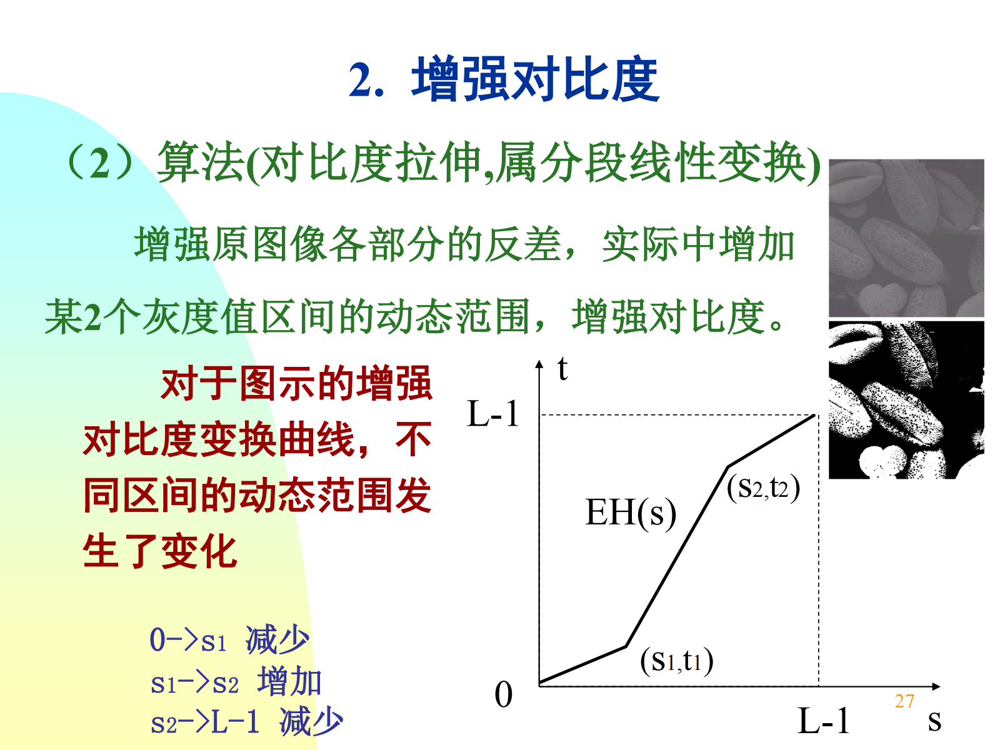
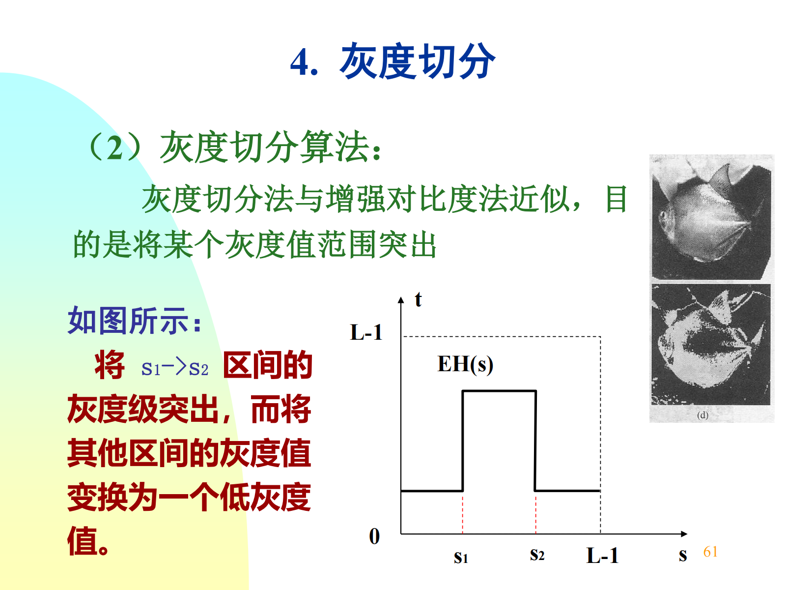

# 第三章 空域图像增强

## 3.1 图像增强概述

点操作：对单点像素操作，与邻域无关。模板操作的特例.

模板操作：对图像某个区域操作。

## 3.2 空间变换增强

### 3.2.1 图像间运算

图像间算术运算：加（可平均消除噪声）、减（可凸显差异，如运动物体检测）、乘、除。

图像间逻辑运算：与（mask操作）、或、非、异或。

补充知识：

色温是表示光线中包含颜色成分的一个计量单位，以温度的度量单位来记录颜色的程度，可以简单理解为颜色的温度。当黑体加热到一定的温度，黑体发出的光所含的光谱成分，就称为这一温度下的色温，计量单位为“K”（开尔文）。在摄影中，某一光源发出的光，与某一温度下黑体发出的光所含的光谱成分相同，就称为某K色温。

白平衡：白色的平衡，由于人眼的适应性，在不同色温下，都能准确判断出白色，但是相机在不同色温的光源下，会出现图像偏色，与人眼看到的颜色不一致，因此需要进行白平衡处理。

白平衡算法——**灰度世界算法**：
以灰度世界假设为基础，认为对于一幅有着大量色彩变化的图像, RGB 三个分量的平均值趋于同一个灰度K。

1. 确定灰度K：取固定值128或RGB三通道的平均值。
2. 计算各通道增益，即K与通道均值之比。
3. 根据增益调整RGB分量。

白平衡算法——**完美反射算法**：
假设图像世界中最亮的白点是一个镜面，能完美反射光照。基于白点，将三通道的数值进行适当地调整，以达到白平衡效果。

1. 计算每个像素的RGB通道之和，按大小计算出其前10%或其他比例的白色参考点的阈值T。
2. 计算图像三通道数值和大于T的点（即亮区）的各通道均值。
3. 计算各通道增益，即通道最大值与亮区通道均值之比。根据增益调整RGB分量。

### 3.2.2 图像灰度映射

灰度映射函数 $t=E_H(s)$。

基本灰度变换：

图像求反：灰度值反转 $t=(L-1)-s$。

增强对比度：分段拉伸函数。

动态范围调整(压缩)：调整灰度变化的动态范围，低灰度范围的值得到扩展，高灰度范围的值得到压缩，使图像分布均匀。
常用对数变换 $t=c\cdot\log(1+s)$

灰度切分：突出某一范围的灰度，将 s1->s2 区间的灰度级突出，而将其他区间的灰度值变换为一个低灰度值。

伽马校正：$t=Cs^{\gamma}$，$\gamma<1$ 提高灰度级，在正比函数上方，使图像变亮。$\gamma>1$ 降低灰度级，在正比函数下方，使图像变暗。

### 3.2.3 直方图变换

图像的灰度统计直方图，$p_s(s_k)=\dfrac{n_k}{n}$ 代表某一灰度出现的概率估计。

直方图均衡化：变换原始图像的直方图为均匀分布，使灰度层次丰富。使像素灰度值的动态范围最大，增强图像整体对比度。

变换函数应满足：在 $0\leq s \leq L-1$ 区间内单值单增，且值域动态范围不变。~~(这几乎是显然的)~~

累积直方图：$t_k=EH(s_k)=\sum\limits_{i=0}^{k}\dfrac{n_i}{n}$。由原图像从0至第k个灰度级的概率密度函数的累积和，作为新图像的第k级灰度的灰度值。相当于将概率密度函数积分为分布函数。

步骤：原图像统计直方图，计算出归一化直方图，再得到累计直方图，再进行区间转换，乘上(灰度级最大值-1)如(256-1=255)，得到原本像素和均衡化后像素的映射关系。

直方图规定化：原始直方图的灰度级概率密度函数 $p_s(s)$，希望得到规定直方图的灰度级概率密度函数 $p_u(u)$，步骤：

1. 对原始直方图进行灰度均衡化：$t_k={EH}_s(s_k)=\sum\limits_{i=0}^k p_s(s_i),k=0,\dots M-1$。
2. 计算能使规定直方图均衡化的变换：$v_k={EH}_u(u_k)=\sum\limits_{i=0}^k p_u(u_i),k=0,\dots N-1,N\leq M$。
3. 求规定直方图的反变换函数 $u={EH}_u^{-1}(v)$。
4. 原始直方图中所得到灰度级 $t$ 代入反变换函数：$u={EH}_u^{-1}(t)={EH}_u^{-1}[{EH}_s(s)]$。需要找出 $t$ 与 $v$ 的近似值，两者近似相等时的 $s,u$ 对应，完成从 $s\to u$ 的变换。

## 3.3 空间滤波增强

### 3.3.1 像素间联系

欧氏距离 $D_E(p,q)=\sqrt{(x-s)^2+(y-t)^2}$，曼哈顿距离 $D_M(p,q)=|x-s|+|y-t|$，棋盘距离 $\max{(|x-s|,|y-t|)}$。

**像素的邻接**：有接触，仅考虑空间关系。

4-邻域 $N_4(p)$：曼哈顿距离为1，边接触，类型为 4-邻接。

8-邻域 $N_8(p)$：棋盘距离为1，边接触+顶点接触，类型为 8-邻接

仅有点接触的4个像素点组成 D-邻域 $N_D(p)$，故 $N_8(p)=N_D(p)+N_4(p)$。

通路：由一系列**依次邻接**的像素组成。通路中相邻两个像素仅有邻接关系。可定义出 4-通路，8-通路。

**像素的连接**：考虑空间和属性关系，有接触且灰度值相似（相等，或者在同一个集合中取值）。

4-连接：2两个像素相似且 $r\in N_4(p)$。

8-连接：2两个像素相似且 $r\in N_8(p)$。

连通：由一系列**依次连接**的像素组成。连通中相邻两个像素有连接关系。可定义出 4-连通，8-连通。

连通是连接的推广，连接是连通的特例。

子集：图象中的（部分）像素的集合。

连通组元：在一个图像子集中与同一个像素相连通的所有像素构成该图像子集中的一个连通组元。（类比离散数学中的连通集）图像中相同连通组元中的2个像素互相连通，不同连通组元中的各个像素互不连通。

连通集：如果子集 S 中只有一个连通组元，即 S 中所有象素都互相连通，则称 S 是一个连通集。一个连通集合称为图像的一个区域。

边界（轮廓）：是区域的一个子集，它将该区域与其他区域分离开，组成区域的边界像素本身属于该区域而在其邻域中有不属于该区域的像素。

像素集合的邻接（图像子集的邻接）：2个图像子集 S 和 T，若 S 中的一个或一些像素与 T 中的一个或一些像素相邻接，则 S 和 T 邻接。有 4-邻接、8-邻接。

像素集合的连通（图像子集的连通）：2个图像子集 S 和 T，若 S 中的一个或一些像素与 T 中的一个或一些像素相连接，则 S 和 T 连接。有 4-连通、8-连通。

### 3.3.2 模板运算

模板卷积步骤：
(1)模板在图中滑动，中心与像素重合。(2)模板系数与对应像素值相乘。(3)所有乘积相加。(4)将和赋予与模板中心对应的像素。

空域滤波增强有：线性/非线性，平滑/锐化。

常见噪声：高斯噪声，脉冲噪声（椒盐噪声），瑞利噪声，均匀分布噪声，伽马噪声，指数分布噪声。

线性平滑滤波——均值滤波器：邻域平均、加权平均、高斯平均、边缘保持平滑。用于模糊处理和减小噪声，提取大目标时消除细节、缝隙。属于低通滤波器。

非线性平滑滤波——中值滤波器：依靠 n*n 的模板对图像进行中值平滑处理，利用区域的中值进行平滑。让与周围像素灰度值相差较大的像素改取与周围灰度值接近的值。消除孤立噪声能力强，因为不是简单取均值，产生模糊较少，保持细节。

## 3.4 局部增强
