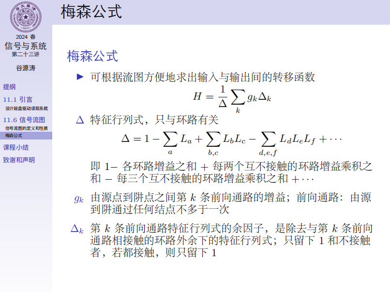

# 第11章 反馈系统

闭环增益表达式，负反馈 $\frac{A}{1+AF}$ ，正反馈 $\frac{A}{1-AF}$ 。

深度负反馈 $AF\gg1\implies H\approx 1/F$，环路增益仅由反馈系数决定。

负反馈的作用：

1. 改善系统灵敏度。增益波动变小。
2. 改善系统频响特性。可以使扩展带宽，降低增益，增益带宽积不变（~~又到了最喜欢的电电~~）。
3. 逆系统设计。直接将原系统组成反馈系统： $H_i(s)=1/H(s)$ 。
4. 不稳定系统变稳定。可以把极点从右半平面移到左半平面。PID算法，比例、微分、积分反馈（~~又到了最喜欢的硬设~~）。

正反馈自激振荡， $A(s)F(s)=1$ （模值为1，辐角2pi），临界稳定。

信号流图。

流图转置。

梅森公式。

