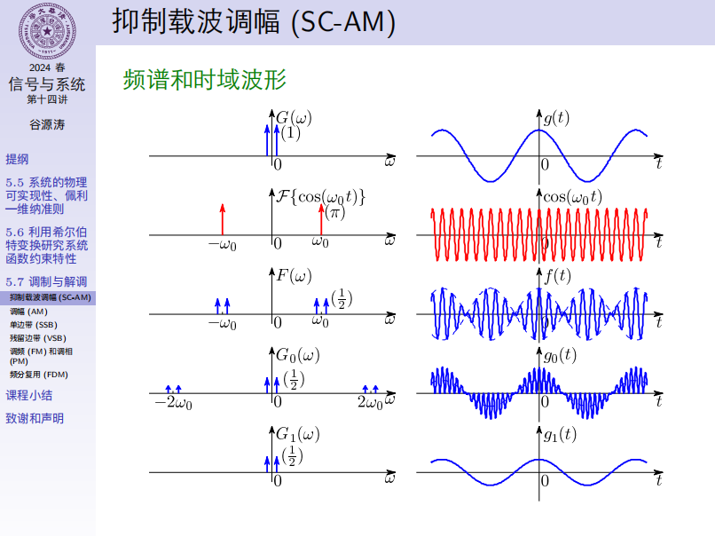
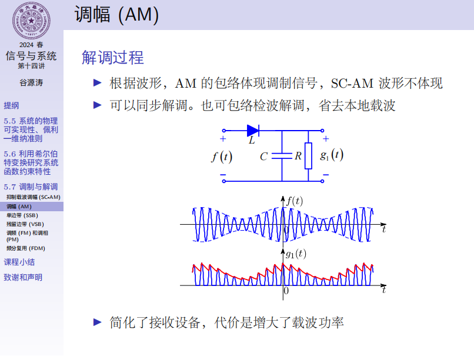
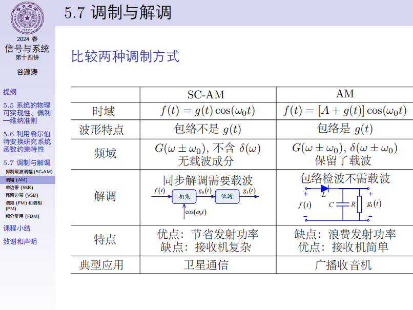
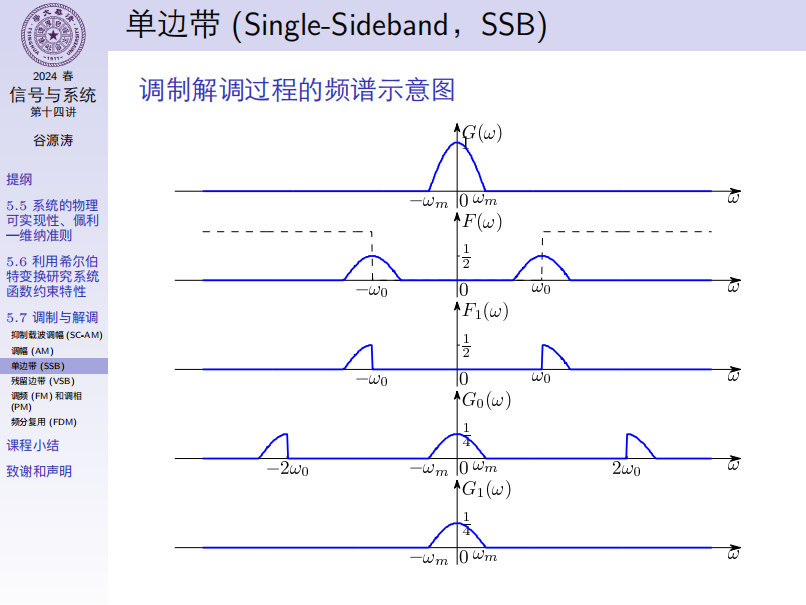
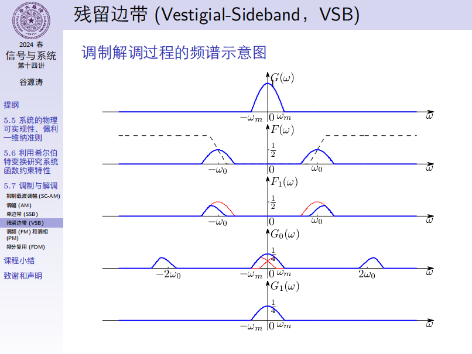
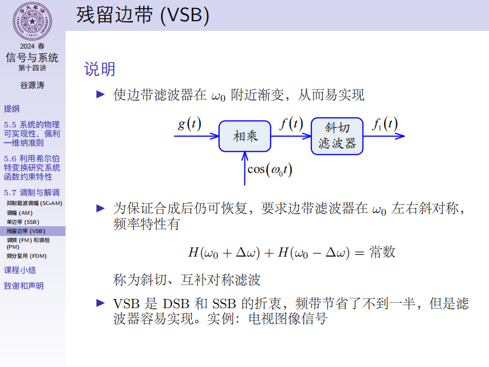
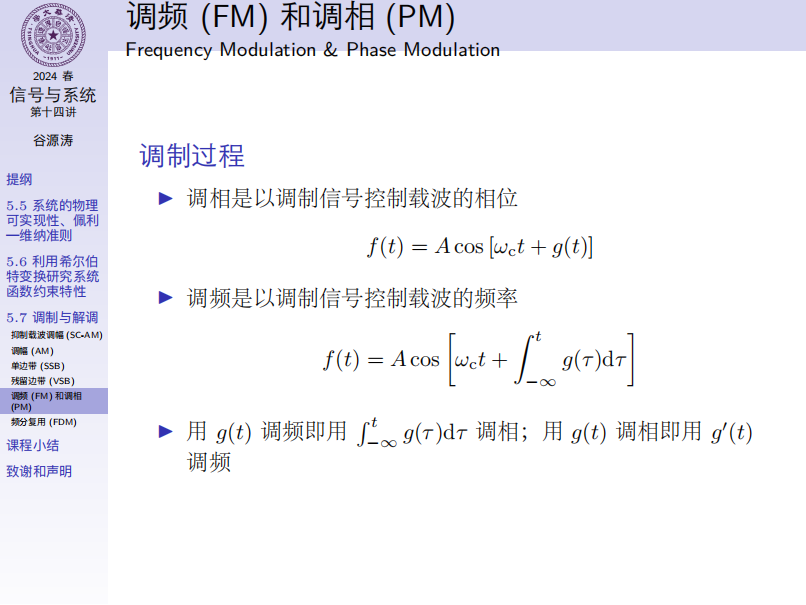
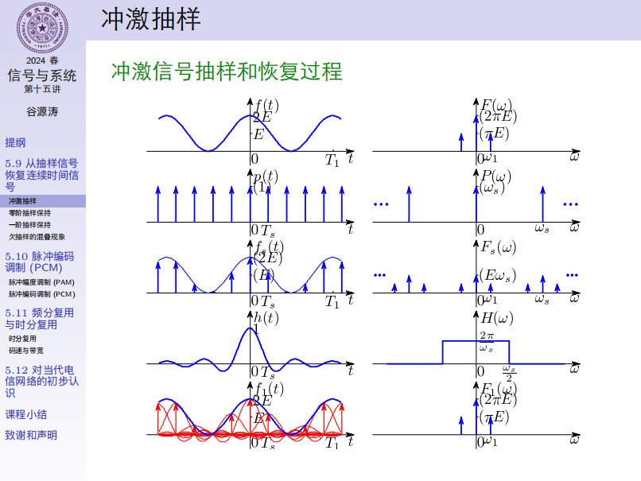
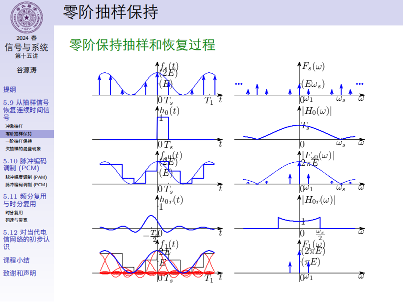
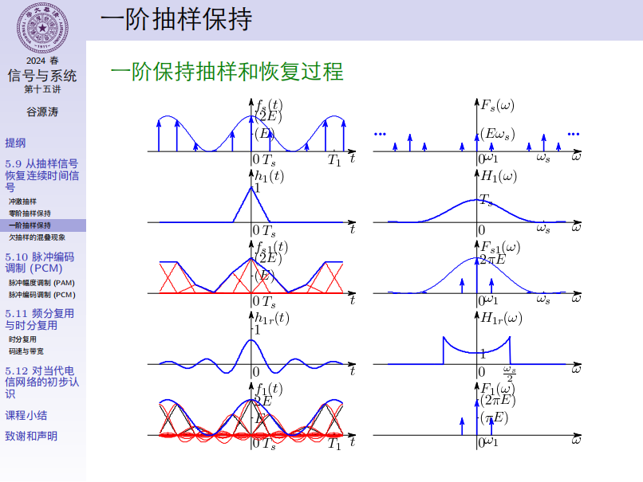

# 第5章 傅里叶变换应用于通信系统

## 1. 系统的物理可实现性与佩利-维纳准则

时域判断：因果性

频域判断：

首先有平方可积条件：

$$
\int_{-\infty}^{\infty}|H(\mathrm{j}\omega)|^2\,\mathrm{d}\omega<\infty
$$

根据帕塞瓦尔定理：

$$
\int_{-\infty}^{\infty}|h(t)|^2\,\mathrm{d}t=
\frac{1}{2\pi}\int_{-\infty}^{\infty}|H(\mathrm{j}\omega)|^2\,\mathrm{d}\omega
$$

佩利-维纳准则（必要不充分条件）：

$$
\int_{-\infty}^{\infty}\frac{|\ln|H(\mathrm{j}\omega)||}{1+\omega^2}\,\mathrm{d}\omega<\infty
$$

不满足 PW 准则的幅度函数，响应比冲激激励先出现，违反了因果性。

PW 准则不允许 $|H(\mathrm{j}\omega)|$ 在某一频带内恒为0（理想滤波器不可能实现），但允许在一些不连续的点为0。

对数函数  $\ln()$ 限制了 $|H(\mathrm{j}\omega)|\to 0$ 的衰减速度。

PW 准则不是物理可实现的充分条件，因为对相频特性 $\varphi(\omega)$ 没有要求。如果已知一个满足 PW 准则的 $|H(\mathrm{j}\omega)|$ ，可以搭配一个适当的相频特性函数 $\varphi(\omega)$ ，使系统物理可实现。

实际上只有多项式函数和双曲函数满足 PW 准则。

## 2. 希尔伯特变换研究系统的约束特性

对于一个因果稳定的系统，将系统函数分解实部虚部 $H(\mathrm{j}\omega) = R(\omega) + \mathrm{j}X(\omega)$ ，实部与虚部的关系为：

$$
R(\omega) = \frac{1}{\pi} \int_{-\infty}^{\infty} \frac{X(\lambda)}{\omega-\lambda}\,\mathrm{d}\lambda
\\
X(\omega) = -\frac{1}{\pi} \int_{-\infty}^{\infty} \frac{R(\lambda)}{\omega-\lambda}\,\mathrm{d}\lambda
$$

实部是虚部的 Hilbert 变换，虚部是实部的 Hilbert 逆变换。实部与虚部相互约束，二者可以互相确定，两者不能任意给定。

另外，对于一个最小相移函数， $\ln|H(\mathrm{j}\omega)|$ 与 $\varphi(\omega)$ 也相互约束。

## 3. 调制与解调

### SC-AM（抑制载波调幅）

调制信号（基带信号） $g(t)$ ，频谱 $G(\omega)$ 占据有限频带 $-\omega_m\sim \omega_m$ 。

已调信号 $f(t)=g(t)\cos(\omega_0t)$ ，把 $g(t)$ 频谱搬移到 $\pm\omega_0$ 上，且分成两部分，各占1/2。

解调：从已调信号 $f(t)$ 恢复出基带信号 $g(t)$ 需要用本地载波 $\cos(\omega_0t)$ ，使频谱 $F(\omega)$ 左右移动，经过低通滤波器（带宽大于 $\omega_m$，小于 $2\omega_0-\omega_m$）之后取出 $G(\omega)$ ，但能量变为原来的一半。
$$
g_0(t) = f(t)\cos(\omega_0 t)=g(t)\cos^2(\omega_0 t)=\frac{1}{2}g(t)(1+\cos(2\omega_0 t))
\\
G_0(\omega) = \frac{1}{2}G(\omega)+\frac{1}{4}[G(\omega+2\omega_0)+G(\omega-2\omega_0)]
$$
注意：$f(t)$ 的频域 $F(\omega)=\frac{1}{2}G(\omega-\omega_0)+\frac{1}{2}G(\omega+\omega_0)$ 不含载波的频谱 $\delta(\omega)$ 。

缺点：解调使用的本地载波需要与发送端相同，接收机较为复杂。

### AM（调幅）

不需要本地载波，接收机简单，适用于日常使用，但是发射功率大，价格较贵。卫星上有应用。

$$
f(t)=[A+g(t)]\cos(\omega_0 t)
$$

其中 $K=1/A$ 为调制深度。

当 $A$ 足够大时，$f(t)$ 的波形包络就是 $A+g(t)$​ ，使用包络检测器（二极管、电容、电阻）即可恢复。

### SSB（单边带）

从中间切开。

为节省频带，只发半个边带，由于频移特性，在收端能恢复。多用于短波通信、跳频电台等。

优点是节省频带，多容纳电台。但“陡峭的”边带滤波器不易制作，所以适用于信号中无直流成分且缺少一段低频成分，此时对边带滤波器的要求放宽。

### VSB（残留边带）

斜着切。

### FM，PM（调频与调相）

FM（调频），直接作用于相位： $f(t)=A\cos(\omega_c t+g(t))$ 。

PM（调相），直接作用于频率： $f(t)=A\cos(\omega_c t+\int_{-\infty}^{t}g(\tau)\,\mathrm{d}\tau)$ 。

本质都是调相。

解调过程：对 $f(t)$ 求导，进行包络检波。

### FDM（频分复用）

对于不同的信号，调制和解调使用不同的 $\cos(\omega_n t)$ ，在频域上占用不同的频率区间，互不干扰。

另有：时分复用，不同的信号占用不同的时间区间，互不干扰。依据为抽样定理，相当于在时域抽样，频域周期延拓，满足奈奎斯特抽样频率的前提下可以分离信号。实际传送的信号并非冲激抽样，可以占有一小段时间。

## 4. 从抽样信号恢复连续时间信号

1. 冲激抽样信号恢复连续时间信号（常规）：时域抽样——频域周期延拓——低通滤波器——恢复。
2. 零阶抽样保持：脉冲信号 $p(t)$ 对信号 $f(t)$ 抽样时，保持样本值到下一次抽样为止，抽样输出信号 $f_s(t)$ 呈阶梯形状。
3. 一阶抽样保持：使用一个冲激响应为三角型脉冲的 LTI 系统，使得由抽样信号 $f_s(t)$ 经过该系统形成的三角脉冲叠加恢复出 $f(t)$ 。

零阶抽样保持和一阶抽样保持都是对第一种方法的逼近。

上述三种方法都要求信号 $f(t)$ 频带受限，且抽样频率满足抽样定理要求。

具体内容可以看书。

