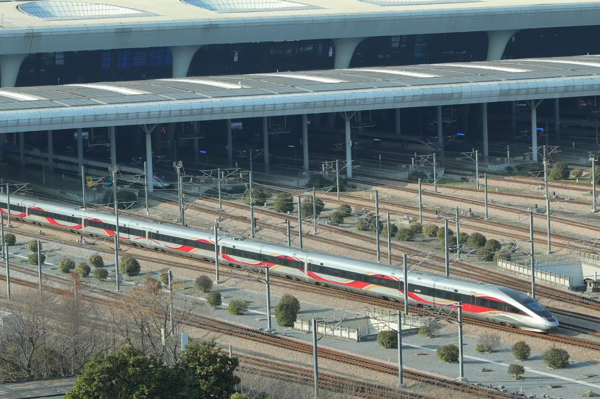
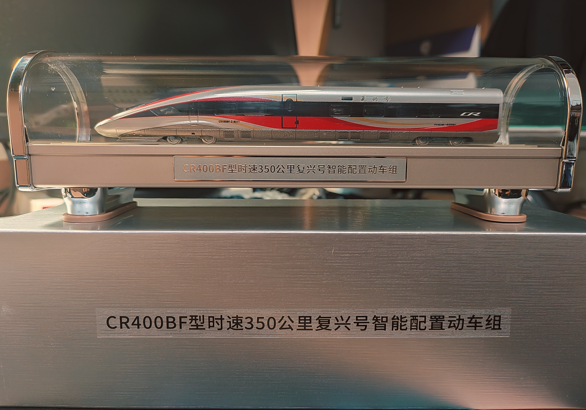
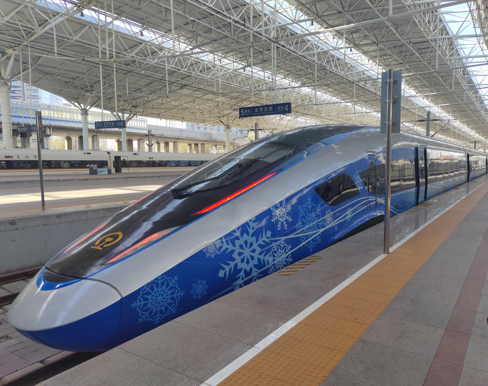

# 中国动车组列车

## 复兴号系列车型

复兴号电力动车组（前称中国标准动车组）是中国自主研发、具有完全知识产权的新一代高速列车。复兴号动车组采用“CR+数字+字母”的分类方式。CR 是中国铁路总公司英文 China Railway 的缩写。数字为速度等级代码，代表最高时速分别为200、220、300、400和450km/h，分别对应160、200、250、350和400km/h五种持续时速。数字后第一位字母是厂商技术平台代码，A 代表来自于中车青岛四方机车车辆和青岛四方庞巴迪铁路运输设备、B 代表来自于中车长春轨道客车和中车唐山机车车辆；最后一位字母是技术代码，F 代表动力分散式、J 代表动力集中式。

### CR400

“400”代表设计时速 400km/h，最高运行时速 350km/h。

CR400AF 由中车青岛四方机车车辆和青岛四方庞巴迪铁路运输设备制造；CR400BF 由中车长春轨道客车和中车唐山机车车辆制造。

2016年7月15日，郑徐高铁上两列复兴号，以超过420公里时速交会，相对时速超过840公里。创造了高铁列车交会、重联运行速度的世界最高纪录。

2017年6月26日11:05分，复兴号在京沪高铁两端的北京南站和上海虹桥站双向首发，分别担当 G123 和 G124。

2021年6月25日，复兴号智能动车组集中上线运营。

2024年6月15日，复兴号技术提升型智能动车组在京沪高铁正式投入运营。车型有：CR400AF-S, CR400AF-BS, CR400BF-S, CR400BF-BS, CR400BF-GS.

型号中“-”后可能含有的字母的含义（例如 CR400AF-BZ，CR400BF-S 等）：

- 无后缀：8节编组普通车型，AF 外号**红神龙**，红色、银色涂装，最初样车为**蓝海豚**蓝色银色涂装。BF 外号**金凤凰**，金色、白色涂装。
- A：京广系统16节长编组，主要营运北京西站及京广高铁暨京广系统以西的省会城市始发之长途跨局车次。
- B：京沪系统17节超长编组，由于站台长度受限，目前17节编组仅营运中国高铁的“金鸡母”之称的京沪高铁为主。
- G：取自“gao”，京哈系统高寒动车。增加了具有抗风、沙、雨、雪、雾、紫外线等恶劣天气能力，可以在-40℃的低温环境下行驶，主要运用在京哈客运专线、京张高铁、呼张客运专线等严寒气候环境的线路。
- C：取自“clever”，智能动车完全版，具有自动驾驶功能。其中 CR400BF-C 为京张高速铁路专用，仅有3列，分别为 CR400BF-C-5162(瑞雪迎春涂装)、CR400BF-C-5144(金凤凰涂装)、CR400BF-C-5145(金凤凰涂装)，其中 5162 和 5145 具有多功能座。CR400AF-C 为京雄城际铁路专用，仅有一列（不算样车），为 **CR400AF-C-2214**(瑞龙智行涂装)，首次使用反鱼骨商务座。
- Z：取自“zhi”，量产并广泛使用的低配版智能动车，阉割了自动驾驶功能，传承了 C 系列智能动车的涂装。AF 智能系列外号**瑞龙智行**，红色、银色涂装，丝带线条较细，车头较尖。BF 智能系列外号**龙凤呈祥**，红色、银色涂装，丝带线条较粗，车头较圆润。。
- S：取自“sheng”，智能动车的技术提升型。涂装与 Z 系列相同，CR400BF 系列的 S 型与 Z 型相比，车头少了一排眉灯，且司机车门更加靠前。
- E：取自 CRH2E 卧铺动车组代号，专为京沪港卧铺量身订制进港专用卧铺动车组。
- J：高速综合检测列车。

目前已经投入运营的车型有：

CR400AF、CR400AF-A、CR400AF-B、CR400AF-C、CR400AF-G、CR400AF-Z、CR400AF-AZ、CR400AF-BZ、CR400AF-S、CR400AF-BS、CR400AF-AE。

CR400BF、CR400BF-A、CR400BF-B、CR400BF-C、CR400BF-G、CR400BF-Z、CR400BF-AZ、CR400BF-BZ、CR400BF-GZ、CR400BF-S、CR400BF-BS、CR400BF-GS。

CR400BF-Z 龙凤呈祥智能动车图片：

作者本人收藏的 CR400BF-Z 龙凤呈祥智能动车模型（仅车头）：

两款全国唯二的特殊彩绘主题列车：

**CR400BF-C-5162**：外号“**瑞雪迎春**”，2022北京冬奥会主题彩绘列车，中车长客量身打造，全国唯一，由北京局代管。2025年1月调图之后，瑞雪迎春仅在跑北京局管内的京张高铁(北京北——张家口区间)，此前曾在跑京呼高铁(北京北——呼和浩特东区间)。瑞雪迎春在世界上首次实现了**350公里时速的自动驾驶**，搭载了移动 5G 超高清演播室。05 车厢为多功能车厢，车上专门设置滑雪器材存放处。2025年1月至2月曾运转京哈高铁，助力哈尔滨亚冬会。如果想**捕捉瑞雪迎春**，在12306购票时可选择带有“多功能座”的复兴号智能动车，有极大概率成功。

下图为作者于2025年3月12日运转京张高铁 G7842 次（张家口——北京北），从清河站上车到达终点站北京北站时，在北京北站拍摄的“瑞雪迎春”。

**CR400BF-Z-0524**：外号“**润泽江南**”，中车长客为2023杭州亚运会量身打造的复兴号亚运智能动车组，全国唯一，车迷称其“**紫茄子**”。不同于瑞雪迎春，润泽江南经常出没于上海局管外各地。

**CR400BF-J-0003**：动检车，外号“**百香果**”。

### CR300

“300”代表设计时速 300km/h，最高运行时速 250km/h。

CR300AF 由中车青岛四方机车车辆制造，外号“**蓝妹妹**”。

CR300BF 由中车长春轨道客车制造，外号“**蓝暖男**”。

### CR220J

“220”代表设计时速 220km/h，最高运行时速 200km/h。

CR220J 由中车南京浦镇车辆、中车唐山机车车辆等制造。目前正处于试验阶段，未投入运营。

### CR200J

“200”代表设计时速 200km/h，最高运行时速 160km/h。

CR200J 由中车南京浦镇车辆、中车青岛四方机车车辆、中车唐山机车车辆、中车株洲电力机车、中车大同电力机车、中车大连机车车辆制造。

目前已经投入运营的车型有：FXD1-J、FXD3-J、HXD1D-J、FXN3-J。

外表是动车，内部其实是普铁绿皮。普铁线路，动车票价。绿色涂装十分丑陋，国铁称其为“绿巨人”，车迷口中的“**垃圾桶**”、“**立及甬**”。第二代白色+绿色涂装被称为“**AD钙**”。(~~1动8托也好意思叫动车？~~)

### CR450

“450”代表设计时速 450km/h，最高运营时速 400km/h。

CR450AF 由中车青岛四方机车车辆制造，涂装外号**锐龙追梦**；CR450BF 由中车长春轨道客车制造，涂装外号**科技之光**。目前正处于试验阶段，未投入运营。

2024年12月29日，中国铁路科学学院（铁科院）公布了 CR450 家族的两个原型：**CR450AF-0201** 和 **CR450BF-0501**，目前在北京环铁轨道上进行试验。

## 和谐号系列动车组列车车型

和谐号电力动车组，是2004年中国引进德国、日本、法国、加拿大等国的高速动车组技术，在消化吸收再创新的基础上，生产的高速动车组系列的总称。“CRH”代表 China Railway High-speed。

### CRH1

CRH1A 大地铁。

CRH1A-A 萌地铁。

CRH1B 长地铁（长编组）。

CRH1E 卧地铁，睡地铁。

### CRH2

CRH2A 带鱼。

CRH2B 长带鱼（长编组）。

CRH2C 疯带鱼。

CRH2E 卧带鱼，睡带鱼。

CRH2G 骏马。

### CRH3

CRH3A 黄金眼。

CRH3C 兔子爹。

### CRH5

CRH5A 动驴。

CRH5G 高寒驴。

CRH5E 熊猫。

### CRH6

### CRH380

CRH380A，外号“**老鼠**”。

CRH380AL，外号“长老鼠”。

CRH380AN-0206，外号“永磁鼠”，全路仅一列，现配属成都局。

2010年12月3日，京沪高铁枣庄至蚌埠段试验中，中国南车（现中车青岛四方）研制的和谐号 CRH380A 新一代高速列车，**CRH380AL-2541** 在宿州东站附近跑出**486.1公里时速**，刷新世界铁路运营速度记录。千里京沪今犹在，不见当年冲高鼠。

**CRH380AM-0204**：外号“**青铜剑**”，高速综合检测列车。唯一车头车尾造型不同的动车。2014年1月16日，CRH380AM-0204 试验速度达到时速605公里。

CRH380B，外号“**兔子**”。

CRH380BL，外号“长兔子”。

CRH380BG，外号“高寒兔”。

2011年1月9日，采用特殊试验编组(8M4T)的 CRH380BL 在京沪高铁徐州至蚌埠先导段运行试验，创造了**487.3公里时速**的最高试验速度，打破了 CRH380A 一个月前创下的记录。

CRH380CL，外号“大鲨鱼”。

CRH380D，外号“疯地铁”。
